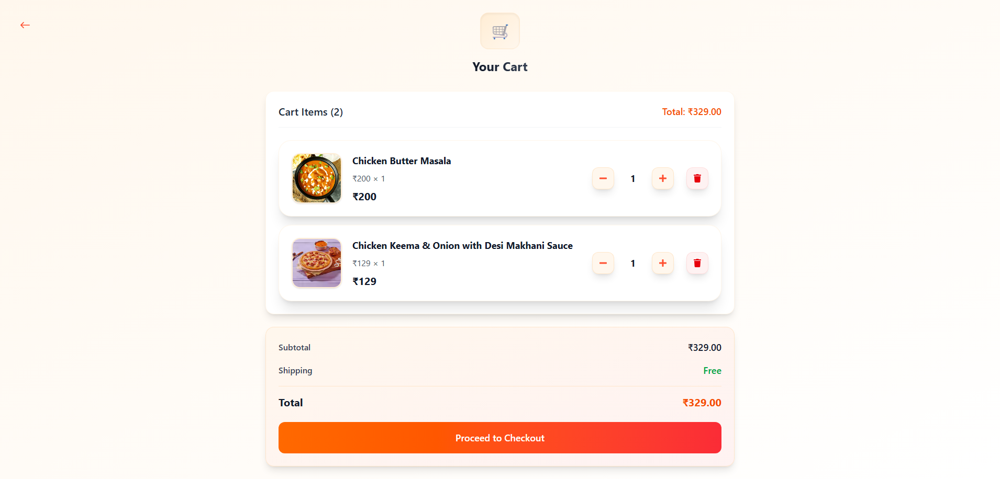
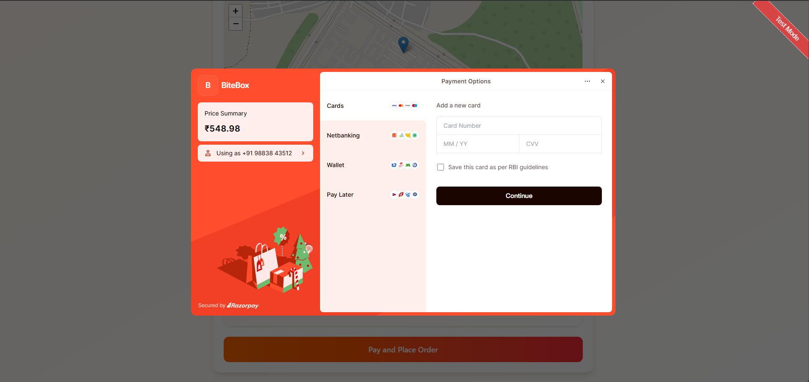
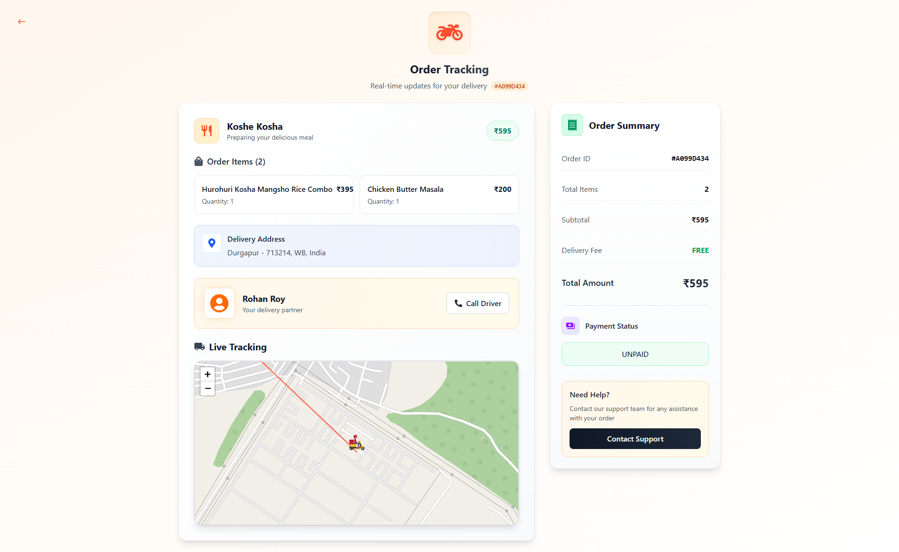
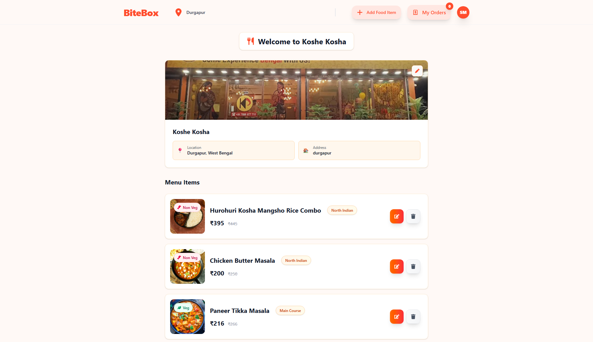
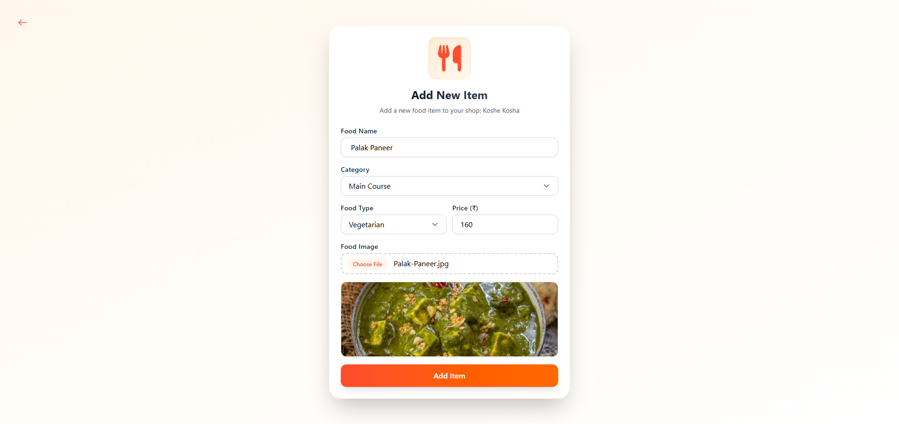
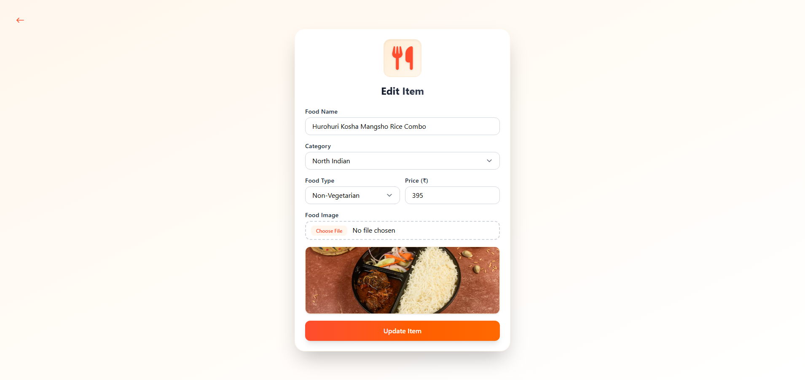
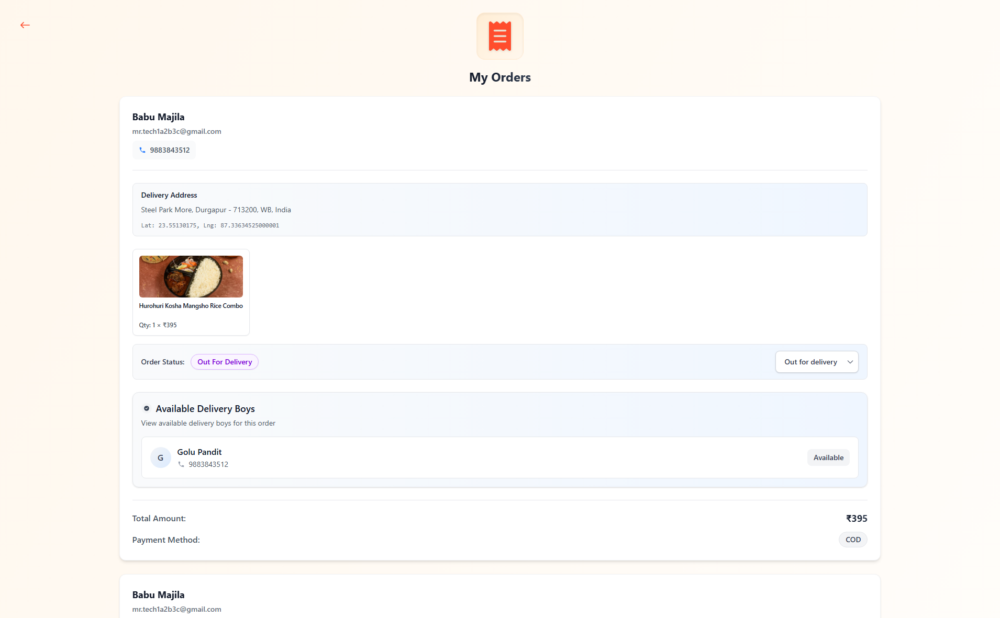
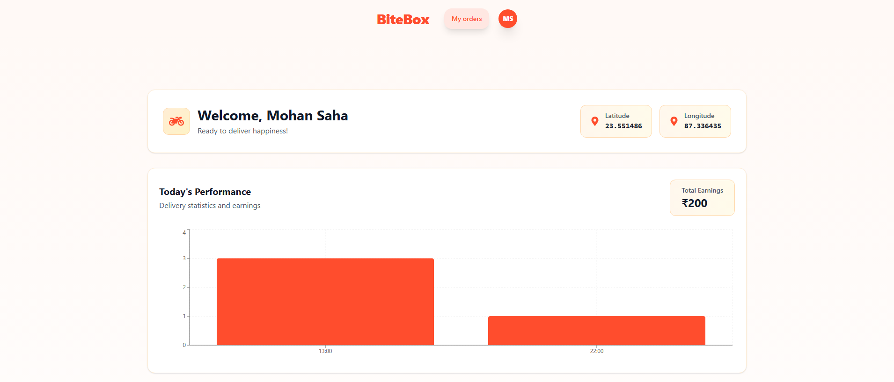
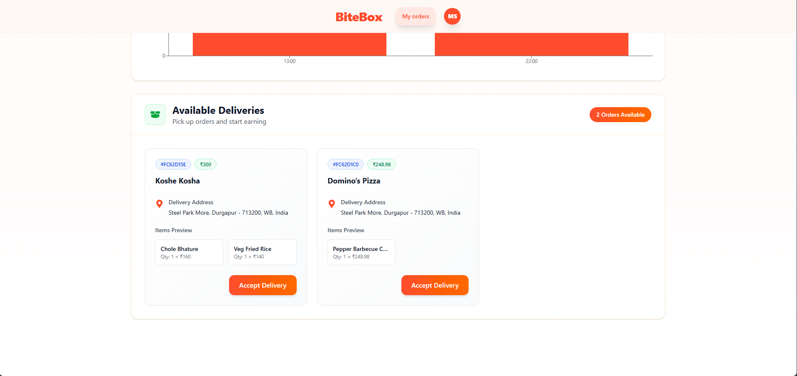
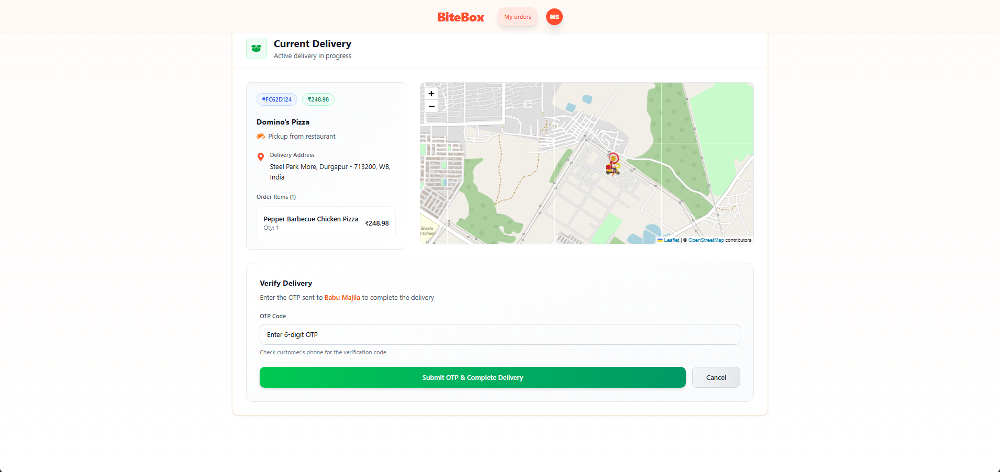

<h1 align="center">
  BiteBox 🍔
</h1>

<p align="center">
  A full-stack MERN food delivery application with real-time order tracking, Razorpay payments, Firebase OAuth, Brevo mail service, and a modern UI for customers and admins.
</p>

## User Role

<table align="center">
  <tr>
    <td align="center">
      
    </td>
    <td align="center">
      
    </td>
    <td align="center">
      
    </td>
    <td align="center">
      
    </td>
  </tr>
</table>

## Restaurant Owner Role

<table align="center">
  <tr>
    <td align="center">
      
    </td>
    <td align="center">
      
    </td>
    <td align="center">
      
    </td>
    <td align="center">
      
    </td>
  </tr>
</table>

## Delivery Boy Role

<table align="center">
  <tr>
    <td align="center">
      
    </td>
    <td align="center">
      
    </td>
    <td align="center">
      
    </td>
  </tr>
</table>

## 🔋 Features

- 👤 **User registration and login** with secure authentication
- 🔑 **JWT and Firebase OAuth** with role-based access control
- 💻 **Seamless frontend auth flow** (signup, login, logout)
- ☁️ **Image upload** via Cloudinary and Multer
- 📬 **Automated mail service** using Brevo Studio
- 👥 **Three distinct roles**: User, Restaurant Owner, Delivery Boy
- 🛒 **User features**: Order food items, pay via COD or Razorpay, and track orders in real-time on an interactive map
- 🏪 **Restaurant Owner features**: Add, edit, delete food items, and manage order status (Pending, Preparing, Out for Delivery)
- 🚚 **Delivery Boy features**: Accept orders, track delivery routes in real-time on map, and update order status with OTP validation upon delivery
- ⚡ **Real-time updates** for all actions using Socket.io

## ⚙️ Tech Stack

- **🎨 Frontend**: React, Tailwind CSS, React Router, Redux, React Leaflet (Map)
- **🛠 Backend**: Node.js, Express.js, Multer
- **🗄 Database**: MongoDB, Mongoose
- **☁️ Cloud Storage**: Cloudinary
- **🔐 Authentication**: JWT, Firebase OAuth
- **📧 Mail Service**: Brevo Studio
- **💸 Payment Gateway**: Razorpay
- **📍 Real-time Tracking**: Socket.io

## 🤸 Installation

### 1. Clone the Repository

```bash
git clone https://github.com/soumadip-dev/BiteBox-MERN.git
cd BiteBox-MERN
```

### 2. Backend Setup

```bash
cd server
pnpm install
```

Create a `.env` file in the `server` directory with the following variables:

```env
PORT=<YOUR_PORT_NUMBER>
MONGO_URI=<YOUR_MONGO_URI>
BACKEND_URL=<YOUR_BACKEND_URL>
FRONTEND_URL=<YOUR_FRONTEND_URL>
NODE_ENV=<YOUR_NODE_ENV>
JWT_SECRET=<YOUR_JWT_SECRET>
JWT_EXPIRES_IN=<YOUR_JWT_EXPIRES_IN>
BREVO_HOST=<YOUR_BREVO_HOST>
BREVO_PORT=<YOUR_BREVO_PORT>
BREVO_USERNAME=<YOUR_BREVO_USERNAME>
BREVO_PASSWORD=<YOUR_BREVO_PASSWORD>
BREVO_SENDEREMAIL=<YOUR_BREVO_SENDEREMAIL>
COMPANY_NAME=<YOUR_COMPANY_NAME>
GOOGLE_CLIENT_ID=<YOUR_GOOGLE_CLIENT_ID>
GOOGLE_CLIENT_SECRET=<YOUR_GOOGLE_CLIENT_SECRET>
GITHUB_CLIENT_ID=<YOUR_GITHUB_CLIENT_ID>
GITHUB_CLIENT_SECRET=<YOUR_GITHUB_CLIENT_SECRET>
CLOUDINARY_CLOUD_NAME=<YOUR_CLOUDINARY_CLOUD_NAME>
CLOUDINARY_API_KEY=<YOUR_CLOUDINARY_API_KEY>
CLOUDINARY_API_SECRET=<YOUR_CLOUDINARY_API_SECRET>
RAZORPAY_KEY_ID=<YOUR_RAZORPAY_KEY_ID>
RAZORPAY_KEY_SECRET=<YOUR_RAZORPAY_KEY_SECRET>
```

### 3. Frontend Setup

```bash
cd ../client
pnpm install
```

Create a `.env` file in the `client` directory with the following variables:

```env
VITE_BACKEND_URL=<YOUR_BACKEND_URL>
VITE_FIREBASE_API_KEY=<YOUR_FIREBASE_API_KEY>
VITE_FIREBASE_AUTH_DOMAIN=<YOUR_FIREBASE_AUTH_DOMAIN>
VITE_FIREBASE_PROJECT_ID=<YOUR_FIREBASE_PROJECT_ID>
VITE_FIREBASE_STORAGE_BUCKET=<YOUR_FIREBASE_STORAGE_BUCKET>
VITE_FIREBASE_MESSAGING_SENDER_ID=<YOUR_FIREBASE_MESSAGING_SENDER_ID>
VITE_FIREBASE_APP_ID=<YOUR_FIREBASE_APP_ID>
VITE_GEOAPI_KEY=<YOUR_GEOAPI_KEY>
COMPANY_NAME=<YOUR_COMPANY_NAME>
```

### 4. Run the Application

- **Backend (Terminal 1)**:

```bash
cd server
pnpm run dev
```

- **Frontend (Terminal 2)**:

```bash
cd ../client
pnpm run dev
```
