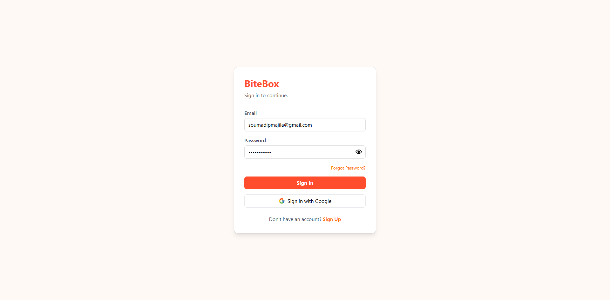
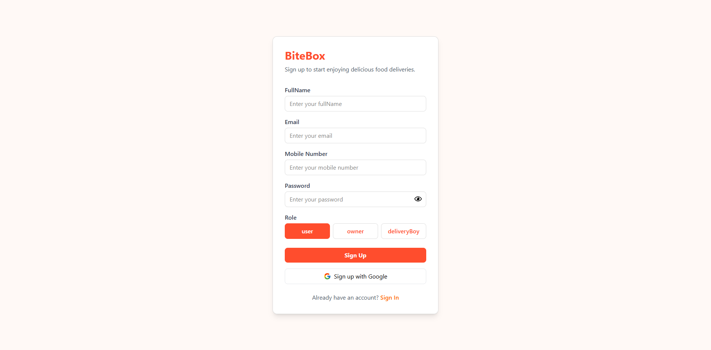

<h1 align="center">
   
  BiteBox 🍔
   
</h1>

  A full-stack MERN food delivery application with real-time order tracking, Razorpay payments, Google OAuth, and a modern UI for customers and admins.

<table align="center">
  <tr>
    <th>Login Page</th>
    <th>Register Page</th>
  </tr>
  <tr>
    <td align="center">
      
    </td>
    <td align="center">
      
    </td>
  </tr>
</table>

## 🌟 Features (Current)

- 👤 User registration and login
- 🔑 JWT authentication
- 🔗 Google OAuth integration
- 🛡 Protected routes on backend
- 💻 Basic frontend auth flow (login, logout)

## ⚙️ Tech Stack

- **🎨 Frontend**: React, Tailwind CSS, React Router, Redux
- **🛠 Backend**: Node.js, Express.js
- **🗄 Database**: MongoDB, Mongoose
- **🔐 Auth**: JWT, Google OAuth
- **💳 Payments**: Razorpay
